<div align="center">



<br><br>

# Cifra

### Personal Finance, made simple.

A mobile-first personal finance application designed to help users understand where their money goes, plan ahead and build better financial habits.

<br>

`Next.js` · `React` · `TypeScript` · `Supabase` · `PostgreSQL` · `Capacitor`

<br>

</div>

---

## ✦ Preview

<div align="center">


&nbsp;

&nbsp;


<br><br>

<sub>Dashboard · Transaction Management · Financial Profile</sub>

</div>

<br>

## ⌁ About Cifra

**Cifra** is a personal finance application focused on making everyday money management simple and accessible.

It provides a centralized space where users can register their income and expenses, create budgets, define savings goals, manage recurring payments and understand their financial activity through reports and visual insights.

The interface was designed with a **mobile-first approach**, while the application uses Supabase for authentication, database management and user data isolation.

> The goal is simple: make personal finances easier to understand without overwhelming the user.

<br>

## ⌁ Features

<table>
<tr>
<td width="50%" valign="top">

### 💳 Money Management

- Track income and expenses
- Custom categories
- Multiple payment methods
- Transaction history
- Date and time tracking
- Financial overview

</td>

<td width="50%" valign="top">

### 🎯 Planning

- Monthly budgets
- Savings goals
- Budget progress tracking
- Recurring payments
- Financial calendar
- Monthly summaries

</td>
</tr>

<tr>
<td width="50%" valign="top">

### 📊 Insights

- Financial reports
- Income vs. expense analysis
- Visual activity charts
- Monthly financial summaries
- Automatic financial insights
- Real-time calculations

</td>

<td width="50%" valign="top">

### 🔐 Security

- Supabase Authentication
- PostgreSQL database
- Row Level Security
- User-isolated financial data
- Secure database policies
- Protected user sessions

</td>
</tr>
</table>

<br>

## ⌁ Tech Stack

<div align="center">


<br><br>

</div>

| Layer | Technology |
| --- | --- |
| Frontend | Next.js 14 · React |
| Language | TypeScript |
| Backend | Supabase |
| Database | PostgreSQL |
| Authentication | Supabase Auth |
| Security | Row Level Security |
| Mobile | Capacitor |
| Icons | Lucide React |
| Styling | CSS |
| Architecture | Next.js App Router |

<br>

## ⌁ Architecture

```text
                         ┌───────────────┐
                         │     USER      │
                         └───────┬───────┘
                                 │
                                 ▼
                  ┌──────────────────────────┐
                  │       CIFRA CLIENT       │
                  │                          │
                  │   Next.js + React        │
                  │   Mobile-first UI        │
                  │   TypeScript             │
                  └────────────┬─────────────┘
                               │
                               ▼
                  ┌──────────────────────────┐
                  │         SUPABASE         │
                  │                          │
                  │   Authentication         │
                  │   PostgreSQL             │
                  │   Row Level Security     │
                  │   Database Logic         │
                  └────────────┬─────────────┘
                               │
                               ▼
                  ┌──────────────────────────┐
                  │     USER FINANCIAL       │
                  │          DATA            │
                  │                          │
                  │ Transactions · Budgets   │
                  │ Goals · Categories       │
                  │ Recurring Payments       │
                  └──────────────────────────┘


                  ───── Mobile Build ─────

                  Next.js
                     │
                     ▼
                  Capacitor
                     │
                     ▼
                   Android
```

<br>

## ⌁ Project Highlights

### ◇ Smart recurring payments

Cifra handles recurring financial movements intelligently when the user accesses the application, reducing the need for external CRON infrastructure for normal usage.

### ◇ Privacy by design

Financial information is isolated at the database level using **PostgreSQL Row Level Security**, ensuring users only access their own data.

### ◇ Mobile-first experience

The interface was designed around mobile usage from the beginning rather than adapting a desktop interface afterward.

### ◇ Financial overview

Transactions, budgets, goals and reports work together to provide users with a clearer picture of their financial situation.

### ◇ Native Android support

Using **Capacitor**, the web application can be packaged and distributed as an Android application while maintaining the same application logic.

<br>

## ⌁ Database

Cifra uses **PostgreSQL through Supabase**.

The project includes database migrations inside:

```text
supabase/migrations/
```

The main migrations configure the application's core financial structure and recurring payment logic.

Additional database documentation is available in:

```text
DATABASE.md
SUPABASE_SETUP.md
```

<br>

## ⌁ Local Development

### 1. Clone the repository

```bash
git clone https://github.com/Ameliaxc1907/Cifra-app.git
cd Cifra-app
```

### 2. Install dependencies

```bash
npm install
```

### 3. Configure environment variables

Create:

```text
.env.local
```

Add your own Supabase project credentials:

```env
NEXT_PUBLIC_SUPABASE_URL=your_supabase_project_url
NEXT_PUBLIC_SUPABASE_ANON_KEY=your_supabase_anon_key
```

> Never commit `.env.local` or private credentials to the repository.

### 4. Start the development server

```bash
npm run dev
```

Then open:

```text
http://localhost:3000
```

<br>

## ⌁ Android

Cifra can also run as an Android application through **Capacitor**.

After building the web application:

```bash
npm run build
```

Synchronize the project with Android:

```bash
npx cap sync android
```

The Android project is located in:

```text
android/
```

Additional instructions are available in:

```text
ANDROID_BUILD.md
```

<br>

## ⌁ Project Structure

```text
Cifra-app/
│
├── android/             # Capacitor Android project
├── app/                 # Next.js App Router
├── assets/              # README assets and project visuals
├── components/          # Application UI components
├── icons/               # Application icons
├── lib/                 # Shared logic and integrations
├── public/              # Static resources
├── supabase/            # Database configuration & migrations
│
├── ANDROID_BUILD.md
├── DATABASE.md
├── PRODUCTION_CHECKLIST.md
├── SUPABASE_SETUP.md
├── capacitor.config.ts
├── package.json
└── README.md
```

<br>

## ⌁ Project Status

<div align="center">

### ✓ COMPLETE

The main version of Cifra is functional and complete.

Future development may include new features, UI improvements and additional financial tools.

<br>

`design` · `build` · `learn` · `improve`

</div>

<br>

---

<div align="center">

### ✦ CIFRA

**Personal Finance, made simple.**

<sub>Built to make personal finance a little less complicated.</sub>

<br><br>

Developed by **Amelia Vergara**

<br>

[GitHub Profile](https://github.com/Ameliaxc1907)

</div>
