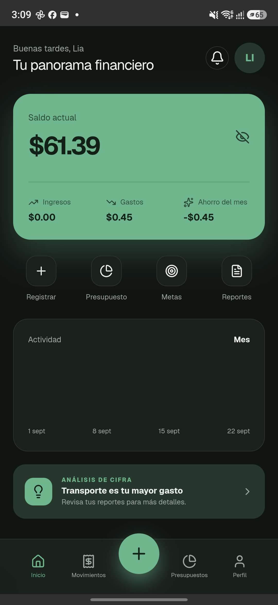
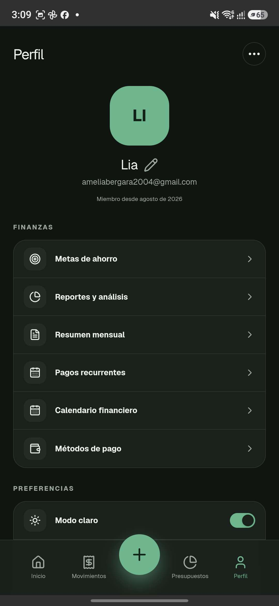
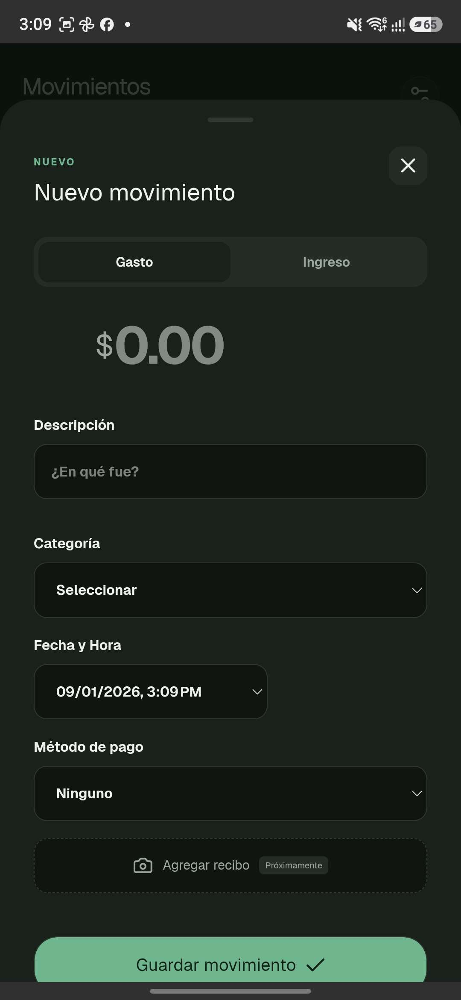

<div align="center">

# Cifra

### Personal Finance, made simple.

A mobile-first personal finance application designed to make managing your money simple, visual and intuitive.

<br>


<br><br>

`Next.js` · `React` · `TypeScript` · `Supabase` · `PostgreSQL` · `Capacitor`

</div>

<br>

---

## ✦ Preview

<div align="center">


&nbsp;

&nbsp;


<br><br>

<sub>Dashboard · Transaction Management · Financial Profile</sub>

</div>

---

## ⌁ About Cifra

**Cifra** is a personal finance application focused on helping users understand and manage their money without unnecessary complexity.

It provides a mobile-first experience for tracking daily finances, managing budgets, monitoring savings goals and analyzing spending habits.

The application can run on the web or be packaged as a native Android application using Capacitor.

<br>

## ⌁ Features

<table>
<tr>
<td width="50%" valign="top">

### 💸 Money Management

- Income & expense tracking
- Custom categories
- Payment methods
- Transaction history
- Monthly financial overview

</td>

<td width="50%" valign="top">

### 🎯 Planning

- Monthly budgets
- Savings goals
- Progress tracking
- Recurring payments
- Financial summaries

</td>
</tr>

<tr>
<td width="50%" valign="top">

### 📊 Insights

- Financial analytics
- Spending visualization
- Monthly reports
- PDF exports

</td>

<td width="50%" valign="top">

### 🔐 Security

- Supabase Authentication
- PostgreSQL database
- Row Level Security
- User-isolated financial data

</td>
</tr>
</table>

<br>

## ⌁ Tech Stack

<div align="center">


<br><br>

| Layer | Technology |
| :--- | :--- |
| **Frontend** | Next.js · React · TypeScript |
| **Backend** | Supabase |
| **Database** | PostgreSQL |
| **Authentication** | Supabase Auth |
| **Security** | Row Level Security |
| **Mobile** | Capacitor · Android |
| **UI Icons** | Lucide React |

</div>

<br>

## ⌁ Architecture

```text
                   ┌─────────────────────┐
                   │       USER          │
                   └──────────┬──────────┘
                              │
                              ▼
                   ┌─────────────────────┐
                   │   Next.js + React   │
                   │    Mobile-first UI  │
                   └──────────┬──────────┘
                              │
                              ▼
                   ┌─────────────────────┐
                   │      Supabase       │
                   ├─────────────────────┤
                   │ Authentication      │
                   │ PostgreSQL          │
                   │ Row Level Security  │
                   │ Database Logic      │
                   └──────────┬──────────┘
                              │
                              ▼
                   ┌─────────────────────┐
                   │     Capacitor       │
                   │      Android        │
                   └─────────────────────┘
```

<br>

## ⌁ Project Highlights

### 🔄 Smart recurring payments

Recurring financial movements can be processed automatically when the application is used, keeping the user's finances up to date.

### 🔒 Privacy by design

Cifra uses **Row Level Security (RLS)** so authenticated users only have access to their own financial information.

### 📱 Mobile-first

The interface was designed primarily for smartphones and can be packaged as an Android application through Capacitor.

### 📈 Financial overview

Transactions, budgets, savings goals and analytics work together to provide a clear picture of the user's finances.

<br>

---

## ⌁ Local Development

Clone the repository:

```bash
git clone https://github.com/Ameliaxc1907/Cifra-app.git
cd Cifra-app
```

Install dependencies:

```bash
npm install
```

Create a `.env.local` file:

```env
NEXT_PUBLIC_SUPABASE_URL=your_supabase_url
NEXT_PUBLIC_SUPABASE_ANON_KEY=your_supabase_anon_key
```

Start the development server:

```bash
npm run dev
```

Then open:

```text
http://localhost:3000
```

<br>

## ⌁ Database Setup

Cifra uses **Supabase PostgreSQL**.

Database migrations are located inside:

```text
supabase/migrations/
```

Apply the migrations to create the required tables, policies and database logic.

> Never commit your `.env.local` file or private Supabase credentials.

<br>

---

## ⌁ Project Status

```text
STATUS      ████████████████████  Complete
PLATFORM    Web + Android
FOCUS       Personal Finance
```

Cifra is functional and actively maintained as improvements and new ideas are explored.

<br>

---

<div align="center">

### ✦ Cifra

**Built to make personal finance a little less complicated.**

<br>

`design · build · learn · improve`

<br><br>

<sub>Developed by Amelia Vergara</sub>

</div>
